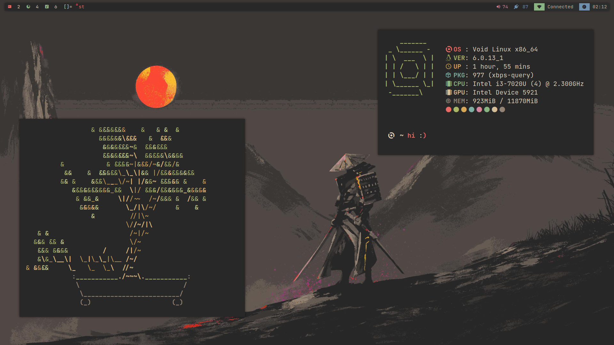
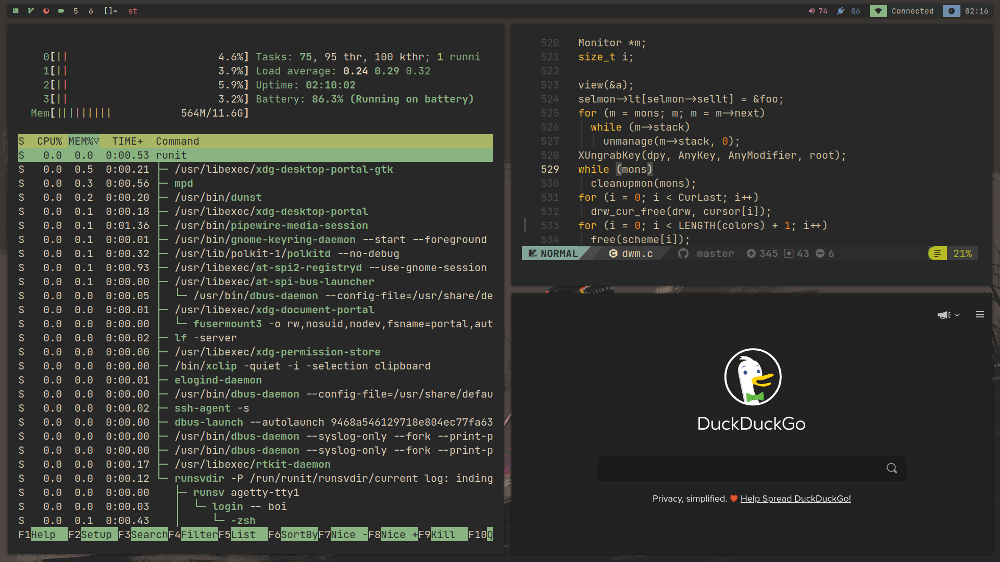
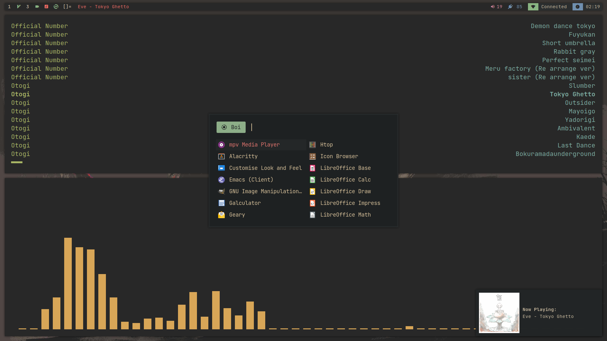

# dotfiles
This is just a personal repository where i store all my dotfiles, you’re free clone them and edit them as you wish.

## The amazing people I stole from
- [siduck-rofi](https://github.com/siduck/dotfiles)
- [NvChad](https://github.com/NvChad)
- Distrotube for [emacs](://gitlab.com/dwt1/dotfiles/-/tree/master/.emacs.d.gnu)

## Dependencies
This system was installed on [void linux](https://voidlinux.org/)

- dwm
- st
- Network Manager
- Light
- Pipewire (as pulse instance or just pulseaudo)
- rofi
- zsh
- picom

# Optional depedencies
- Qutebrowser
- lf
- Nvim
- [GTK and icons](https://github.com/TheGreatMcPain/gruvbox-material-gtk)
